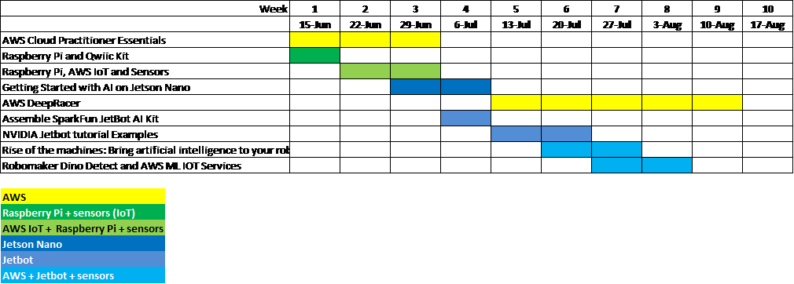

# Summer Intern Challenge 2020

Build and deploy a robot that will drive autonomously while avoiding obstacles, identifying objects and capturing IoT data for analysis. 

These are the main areas we will be focusing on for this summer.
1. AWS Cloud
	1. General Overview
1. AI – ML/DL
	1. Image Classification and Regression - Getting started with AI - Nvidia
	1. Reinforcement Learning - AWS DeepRacer
	1. Supervised Learning - Jetbot
1. IoT and Robotics
	1. Cayenne - simple cloud website to stream sensor data
	1. AWS IoT - stream sensor data
	1. Analyze and Display Sensor Data
	1. ROS, AWS Greengrass, RoboMaker and IoT - Jetbot

## Training Steps
1. [AWS Cloud Practitioner Essentials](https://github.com/jetbotml/Summer_Intern_Challenge_2020/blob/master/1_AWS_Cloud_Practitioner_Essentials)

1. [Raspberry Pi and Qwiic Kit](https://github.com/jetbotml/Summer_Intern_Challenge_2020/blob/master/3_Raspberry_Pi_and_Qwiic_Kit)

	1. [Raspberry Pi, AWS IoT and Sensors](https://github.com/jetbotml/Summer_Intern_Challenge_2020/blob/master/4_RaspberryPi_AWSIoT_Sensors)

1. [Getting Started with AI on Jetson Nano](https://github.com/jetbotml/Summer_Intern_Challenge_2020/blob/master/5_Getting_Started_with_AI_on_Jetson_Nano)

	1. [AWS DeepRacer](https://github.com/jetbotml/Summer_Intern_Challenge_2020/blob/master/2_AWS_DeepRacer)
	1. [Assemble SparkFun JetBot AI Kit](https://learn.sparkfun.com/tutorials/assembly-guide-for-sparkfun-jetbot-ai-kit-v20)
	1. [NVIDIA Jetbot tutorial Examples](https://github.com/NVIDIA-AI-IOT/jetbot/wiki/examples)
	1. [Rise of the machines: Bring artificial intelligence to your robot](https://robomakerworkshops.com/jetbot-ml-workshop/)
	1. [Robomaker Dino Detect and AWS ML IOT Services](https://github.com/jetbotml/Summer_Intern_Challenge_2020/blob/master/9_Robomaker_Dino_Detect_and_AWS_ML_IOT_Services)
	

